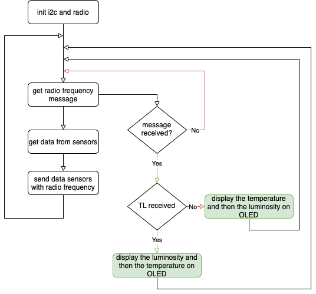

# Microbit capteurs - Equipe 16

# Introduction

Le code est fonctionnel et commenté. Il permet à un microcontrôleur de récupérer les données des capteurs de luminosité et de température ainsi que de communiquer via radiofréquence grâce à un protocole de réseau.

# Architecture

## Déroulement



## Conception

### Variables

```python
'''
 * variables for script
'''
i2c             = i2c.init(freq = 10000, scl = pin19, sda = pin20)
radioProtocol   = protocol.RadioProtocol(2)
```

- `i2c             = i2c.init(freq = 10000, scl = pin19, sda = pin20)` → utilisé pour l'affichage sur écran OLED
- `radioProtocol   = protocol.RadioProtocol(2)` → initialisation du protocole réseau pour la communication entre les deux microcontrôleurs

### Initialisation

```python
'''
 * init comm
'''
radio.config(group = 2, length = 251)
radio.on()
```

- `radio.config(group = 2, length = 251) radio.on()` → initialisation de la communication radiofréquence (pour faire communiquer les deux microcontrôleurs)

`length = 251`, par défaut 32, on augmente pour éviter les éventuelles erreurs de tailles

### Main

```python
'''
 * main program
'''
while True:
	'''
	 * local variables for main
	'''
	msg = radioProtocol.receivePacket(radio.receive_bytes())
	lum = display.read_light_level()
	temp = temperature()
	msgToSend = 'l:' + str(lum) + ',t:' + str(temp) + "\t"
	
	initialize(pinReset = pin0)
	clear_oled()
	radioProtocol.sendPacket(msgToSend, 1)
```

Cette partie du script permet de :

- Recevoir les données envoyées par le deuxième microcontrôleur
    
    ```python
    msg = radioProtocol.receivePacket(radio.receive_bytes())
    ```
    
    → corresponds aux données de **`configuration`** (ordre d'affichage)
    
- Construire un affichage avec les données collectées par les capteurs du microcontrôleur
    
    ```python
    msgToSend = 'l:' + str(lum) + ',t:' + str(temp) + "\t"
    initialize(pinReset = pin0)
    clear_oled()
    ```
    
    → en fonction de la **`configuration`** :
    
    ```python
    if msg:
    	new_msg = msg.replace("'", "")
    	new_msg = new_msg[1:]
    	if new_msg == 'TL':
    	  add_text(0, 0, "Temp :" + str(temp))
    	  add_text(0, 1, "Lum :" + str(lum))
    	else:
    	  add_text(0, 0, "Lum :" + str(lum))
    	  add_text(0, 1, "Temp :" + str(temp))
    ```
    
    → si TL : on affiche la température avant la luminosité
    
    → sinon c'est LT : on affiche la luminosité avant la température
    
- Envoie les données collectées par les capteurs
    
    ```python
    radioProtocol.sendPacket(msgToSend, 1)
    ```
    
    → envoie au deuxième microcontrôleur pour que celui-ci puisse envoyer les données au serveur